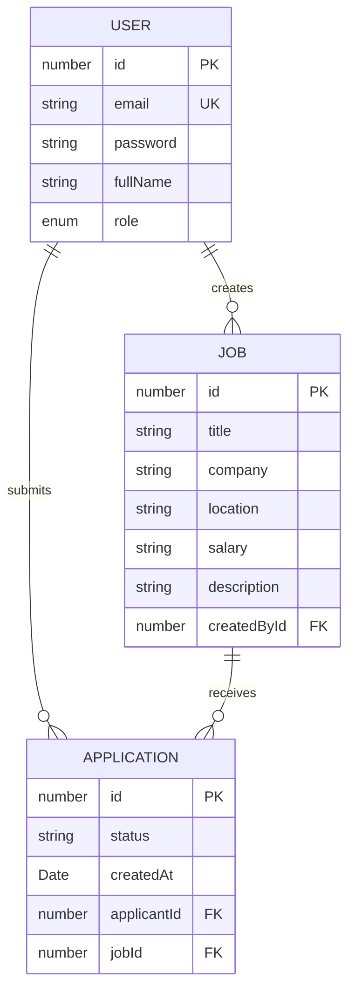

# Database Schema

This document describes the core PostgreSQL database schema used by the Job Portal System.

## Entities

### User

Stores registered users. A user can be a job seeker or employer.

| Field | Type | Notes |
| --- | --- | --- |
| `id` | `number` | Primary key |
| `email` | `string` | Unique user email |
| `password` | `string` | Hashed password |
| `fullName` | `string` | User display name |
| `role` | `enum` | `admin`, `employer`, or `seeker`; defaults to `seeker` |

### Job

Stores job posts created by employers.

| Field | Type | Notes |
| --- | --- | --- |
| `id` | `number` | Primary key |
| `title` | `string` | Job title |
| `company` | `string` | Company name |
| `location` | `string` | Job location |
| `salary` | `string` | Salary range or amount |
| `description` | `string` | Job description |
| `createdBy` | `User` | Employer who created the job |

### Application

Stores seeker applications for jobs.

| Field | Type | Notes |
| --- | --- | --- |
| `id` | `number` | Primary key |
| `status` | `string` | `pending`, `accepted`, or `rejected`; defaults to `pending` |
| `createdAt` | `Date` | Application creation timestamp |
| `applicant` | `User` | Seeker who applied |
| `job` | `Job` | Job being applied to |

Unique constraint:

- One user can apply to a specific job only once: `applicant + job`

## Relationships

- User one-to-many Jobs: one employer can create many jobs.
- User one-to-many Applications: one seeker can submit many applications.
- Job one-to-many Applications: one job can receive many applications.

## ER Diagram

